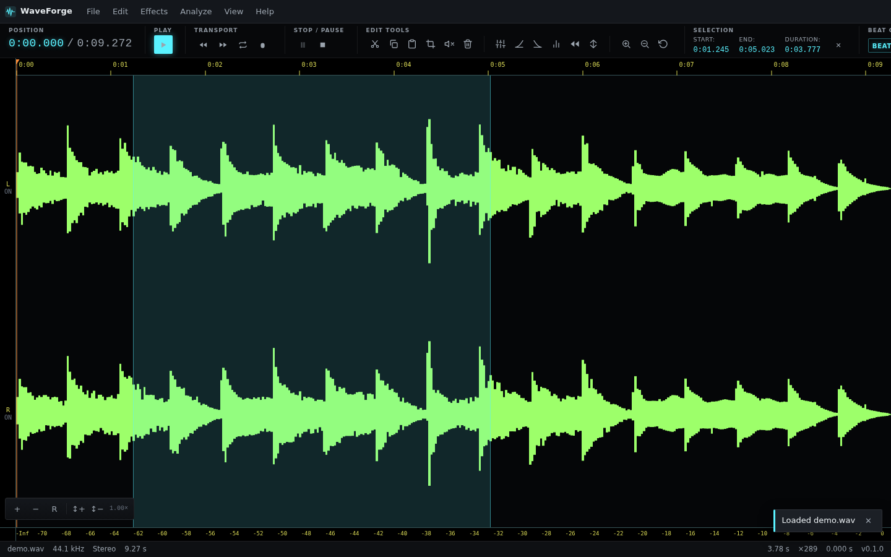
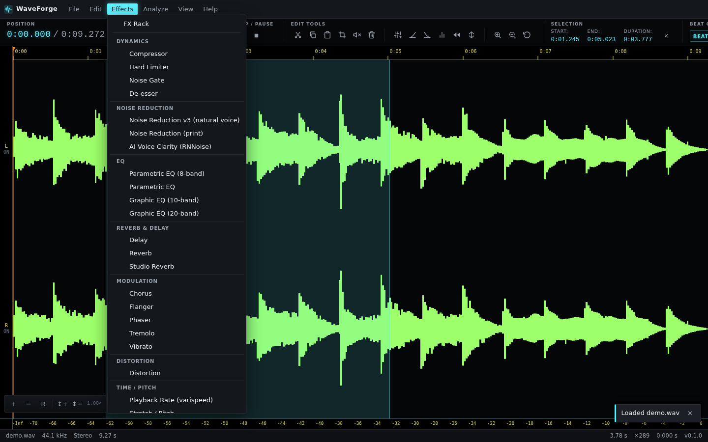
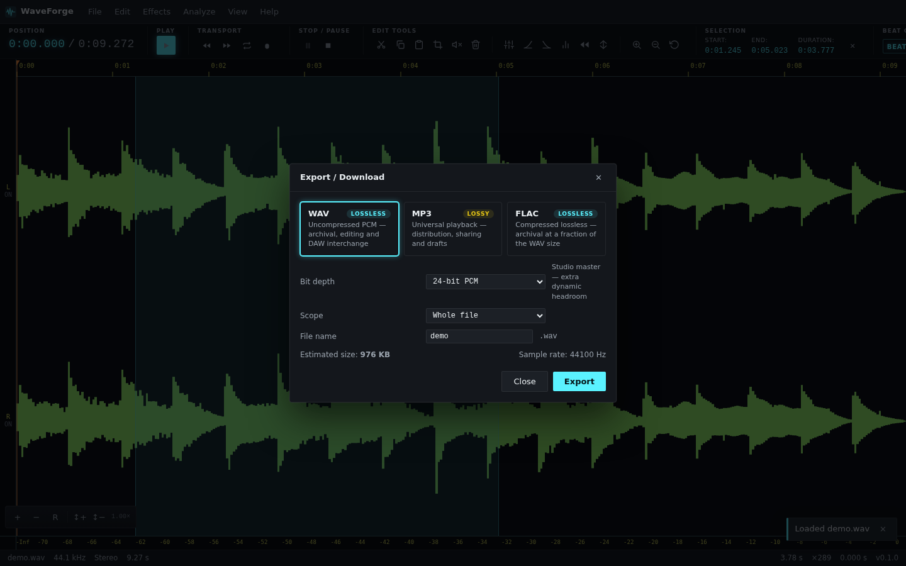
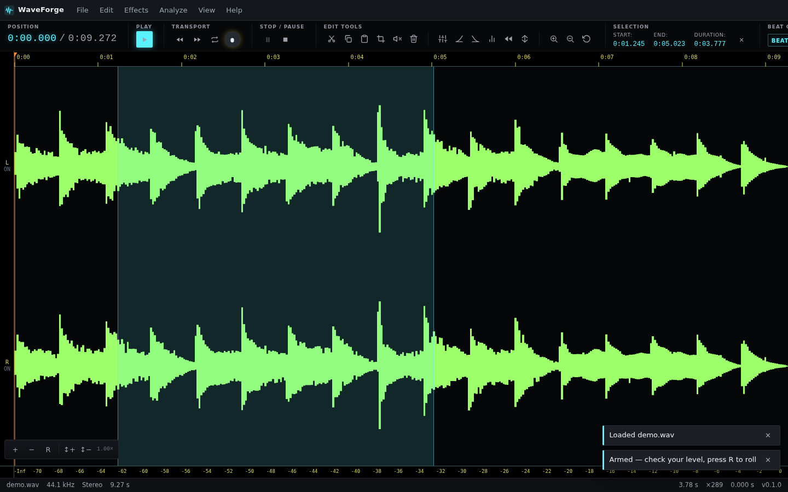
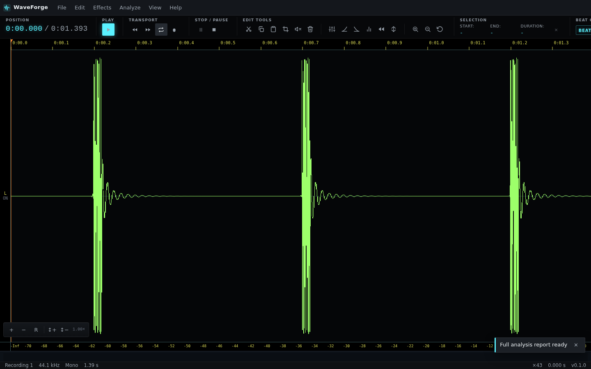

# WaveForge

A free, private, installable web audio editor: record, trim, clean, master,
arrange, and export audio **entirely in your browser**. No uploads, no
accounts, no tracking — your audio never leaves your machine.

<p align="center">
  
</p>

WaveForge began as a light-edition browser-based audio editor and has
grown into a full production tool: multitrack lanes with a clip/arrangement
timeline, an FX rack with per-parameter automation envelopes, three noise
reduction engines (including an RNNoise "AI Voice Clarity" mode), a studio
recording flow with punch in/out, and a LUFS mastering suite with
per-platform delivery targets.

## Highlights

- **100% client-side** — audio is processed on your device via the Web
  Audio API; nothing is uploaded, ever
- **Studio recording** — arm → live peak-hold + clip LED → roll, with
  count-in/metronome, input monitoring, session takes, and non-destructive
  punch in/out (document or active lane, one undoable edit)
- **Professional mastering** — integrated LUFS, true peak, loudness range,
  clipping integrity, per-platform delivery verdicts (Spotify, Apple,
  YouTube, Netflix, EBU…), CSV/clipboard report export
- **Organized effects** — 30+ DSP tools grouped into 9 labeled sections,
  A/B preview, per-parameter automation envelopes, FX Rack chains with
  recipes and presets
- **Installable & offline** — PWA with precache; works without a network

## Screenshots

| | |
|---|---|
|  |  |
| *Effects — 9 labeled tool sections* | *Export — format cards with badges & guidance* |
|  |  |
| *Studio record — armed with live meter* | *Analyze — full mastering report* |

## Features

- **Load**: WAV / MP3 / FLAC / OGG / Opus / AAC/M4A / WebM — file picker,
  drag & drop, URL, or the built-in sample
- **Edit**: cut / copy / paste / trim / silence / delete / normalize /
  reverse / invert / remove-silence, ±5 s transport seeks, zero-cross
  snapping, seamless loop, ≥ 100-step undo with copy-on-write bounces
- **Multitrack + clips**: lanes with per-channel strips (gain / pan / mute
  / solo), clip move / trim / split / duplicate, per-clip envelopes,
  mixdown & per-lane stems
- **Effects** (A/B preview + automation envelopes): compressor, limiter,
  PG-EQ, graphic EQ 10/20, delay, reverb ×2, chorus, flanger, phaser,
  tremolo, vibrato, distortion, gate, de-esser, noise reduction (adaptive
  Wiener + spectral print), **AI Voice Clarity (RNNoise)**, time-stretch /
  pitch-shift (WSOLA), playback rate (varispeed)
- **FX Rack**: serial chains with reorder / bypass, built-in recipes
  (Voice rescue, Podcast polish, Master glue, Warm air), user presets,
  chain JSON import/export
- **Record (studio flow)**: arm/roll via AudioWorklet with device picker
  and constraint toggles; count-in with metronome click (manual or
  detected BPM); input monitoring (feedback-safe default OFF); session
  takes list; punch in/out with pre-roll — `R` / `M` / `P` shortcuts
- **Analyze**: live spectrum/frequency meters, LUFS integrated / short-term
  / momentary / LRA, true peak, stereo correlation, clipping integrity,
  BPM + beat-grid snap, full testable report
- **Export (professional chooser)**: format cards (WAV lossless / MP3
  lossy / FLAC lossless) with labeled quality presets and per-preset
  guidance and a live size estimate; WAV 16/24/32f, MP3 128–320 kbps,
  FLAC 0–8; selection-only; ID3v2 tags on MP3; worker encoding with
  progress + cancel; native save picker when available
- **Interface**: grouped menus (Effects = 9 tool sections; File/View
  grouped too), zone-based transport (position clock first, standalone
  play/pause toggle, ±5 s seeks, record/master anchored right), developer
  credits on Welcome/About
- **Persistence**: IndexedDB drafts + autosave ring (crash recovery),
  everything offline-capable (PWA)

## Technology & architecture

WaveForge is a **worker-first, pure-client PWA**. Every heavy operation —
DSP, encoding, peak computation, loudness analysis — runs off the main
thread; the UI never blocks on audio work.

```
┌────────────────────────── Browser ──────────────────────────┐
│  Preact UI (signals)  ──  command registry (one per action) │
│        │                            │                       │
│  MenuBar / TransportBar / Dialogs   ▼                       │
│  Canvas waveform renderer   ┌───────────────┐               │
│        │                    │  AudioEngine  │  (playback    │
│        ▼                    └───────────────┘   transport)  │
│  peaks.worker ◄── mip cache      │                          │
│  analysis.worker (LUFS/BPM)      ▼                          │
│  mp3Export.worker (lamejs)   AudioContext graph             │
│  flac-export.worker (libFLAC wasm) │                        │
│  recorder.worklet (AudioWorklet)   ▼                        │
│        │                     AudioDocument (immutable, COW) │
│        ▼                            │                       │
│  IndexedDB drafts ◄── autosave ring─┘  history (undo ≥100)  │
└──────────────────────────────────────────────────────────────┘
```

**Stack**

| Layer | Technology | Why |
|---|---|---|
| UI | Preact 11 + `@preact/signals` | tiny runtime, fine-grained updates |
| Build | Vite 8 + TypeScript (strict) | fast dev, typed boundaries |
| DSP | Web Audio API + AudioWorklet | real-time, off-main-thread capture |
| Codecs | lamejs (MP3), libFLAC (WASM) | in-browser encode, no server |
| Analysis | custom FFT workers | LUFS/EBU-R128, BPM, true peak |
| State | signals + pure reducers | testable kernels, immutable docs |
| Tests | Vitest + Playwright (+ axe) | 720 unit, 59 e2e, WCAG gates |
| Quality | ESLint, Prettier, Lighthouse CI | enforced gates, 100 a11y |

**Architecture in one paragraph.** The document model (`AudioDocument`)
is immutable; edits produce new channel arrays committed through a single
`performEdit` gateway, which appends one undoable history entry per user
action and lets the garbage-collector handle the rest (copy-on-write
bounces keep ≥100 undo steps affordable). Multitrack projects layer lanes
and clips on top of documents; every effect — dialog or rack — routes
through one command registry, so menus, shortcuts, and the toolbar can
never drift apart (a unit test enforces it). Playback rides a drift-free
transport (context-clock based) over a per-channel gain/pan graph.
Recording captures through an AudioWorklet into a pure accumulator
buffer; punch in/out splices non-destructively via the same overwrite
edit path as paste, keeping the replaced audio in history. Analysis and
export run in dedicated workers with transferable buffers and
cancelable, progress-reporting jobs. Everything above is pure-client:
the deploy target is a static host plus a service worker.

**Key source map**

```
src/
├── app/         UI shell: state signals, actions, commands, menus,
│                keyboard, dialogs, transport/menu components
├── engine/      AudioDocument, edits (editOps), project (lanes/clips),
│                AudioEngine transport, recorder, metronome/punch/takes,
│                meter, analysis kernels (LUFS/report), edit conform
├── workers/     mp3Export, analysis (LUFS/BPM/report), peaks
├── worklets/    recorder.worklet (AudioWorklet capture)
├── io/          decode, exportService + workers glue, wavEncoder,
│                exportFormats catalog, exportName, id3, drafts
├── fx/          effect definitions + DSP kernels (defs.ts registry)
└── vendor/      rnnoise wasm glue, libflac vendored builds
```

## Documentation

Production documentation set (root):

- [ARCHITECTURE.md](ARCHITECTURE.md) — system architecture, data flows,
  threading model, extensibility, ADR index
- [DESIGN.md](DESIGN.md) — design tokens, layout anatomy, component
  contracts, interaction patterns, accessibility gates
- [MEMORY.md](MEMORY.md) — runtime/undo/session/durable memory models
  and budgets
- [DATABASE.md](DATABASE.md) — IndexedDB schema & versioning (WFD#),
  autosave/crash recovery, deferred MongoDB Atlas cloud design
- [PROJECT_BREAKDOWN.md](PROJECT_BREAKDOWN.md) — the full build history:
  192 commits broken down phase by phase, with gates and metrics

## Development

```bash
npm install --legacy-peer-deps   # peer-dep pinning is intentional
npm run dev                      # dev server
npm run test                     # unit suite (vitest)
npm run -s lint && npx tsc --noEmit   # lint + type gates
npm run build                    # production build to dist/
npx playwright test              # e2e suite (Chromium, fake media)
```

**Quality gates** (enforced per change, ECC workflow): 720/720 unit tests
across 86 files · 59/59 e2e including an axe-core WCAG 2.1 AA
zero-violations suite · Lighthouse ≥ 95/95/100/100 (currently
99/100/100/100 desktop, 99 mobile perf) · ESLint + tsc strict clean.

## Deploy

The build output is a fully static site — deploy anywhere:

**Vercel** (recommended, `vercel.json` included with SPA rewrites +
headers): import the repository, framework preset *Vite*, deploy. The
PWA manifest and service worker are generated by `vite-plugin-pwa` at
build time; no environment variables or server components are required.

## Credits & license

- **Developer**: Mir Md. Masum —
  [mirmasum@mail.com](mailto:mirmasum@mail.com) ·
  [Instagram @mirmd_masum](https://instagram.com/mirmd_masum) · Discord
  `mir_masum`
- MIT — see [LICENSE](LICENSE). Third-party notices for the bundled
  encoders/runtimes in [THIRD_PARTY_NOTICES.md](THIRD_PARTY_NOTICES.md).
